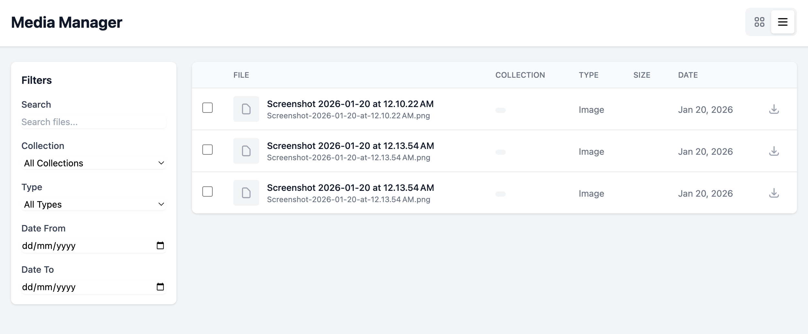
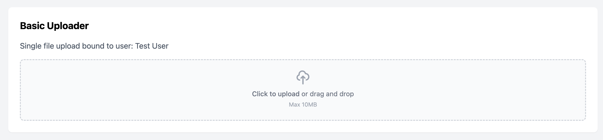

# Spatie Media Library Manager

[](https://packagist.org/packages/cleaniquecoders/media-manager)
[](https://github.com/cleaniquecoders/media-manager/actions?query=workflow%3Arun-tests+branch%3Amain)
[](https://github.com/cleaniquecoders/media-manager/actions?query=workflow%3A"Fix+PHP+code+style+issues"+branch%3Amain)
[](https://packagist.org/packages/cleaniquecoders/media-manager)

A Laravel package that provides a complete media management solution built on top of
[Spatie Media Library](https://spatie.be/docs/laravel-medialibrary). Manage your media files
through a modern, user-friendly interface with Livewire components.

## Features

- Full-featured media browser with grid and list views
- Drag-and-drop file uploads with progress tracking
- Media collection management with reordering support
- Media picker for selecting existing files
- Search, filter, and bulk operations
- Custom properties and metadata support
- Authorization via Laravel gates
- Fully customizable views

## Screenshots

### Media Browser

Browse all your media files with filtering, searching, and bulk operations.



### Media Uploader

Upload files to any model with drag-and-drop support.



### Media Collection

Manage media collections inline with drag-and-drop reordering.


## Installation

Install the package via Composer:

```bash
composer require cleaniquecoders/media-manager
```

Run the install command:

```bash
php artisan media-manager:install
```

Or manually publish and run migrations:

```bash
php artisan vendor:publish --tag="media-manager-migrations"
php artisan migrate
```

Optionally publish the config file:

```bash
php artisan vendor:publish --tag="media-manager-config"
```

## Quick Start

### 1. Add the trait to your model

```php
<?php

namespace App\Models;

use CleaniqueCoders\MediaManager\Concerns\HasMediaManager;
use Illuminate\Database\Eloquent\Model;
use Spatie\MediaLibrary\HasMedia;

class Post extends Model implements HasMedia
{
    use HasMediaManager;

    public function registerMediaCollections(): void
    {
        $this->addMediaCollection('featured')->singleFile();
        $this->addMediaCollection('gallery');
    }
}
```

### 2. Add components to your views

```blade
{{-- Media Browser - embed in your own view with your layout --}}
<livewire:media-manager::browser />

{{-- Media Uploader --}}
<livewire:media-manager::uploader
    :model="$post"
    collection="gallery"
    :max-files="10"
/>

{{-- Media Collection Editor --}}
<livewire:media-manager::collection
    :model="$post"
    collection="gallery"
    sortable
/>

{{-- Media Picker --}}
<livewire:media-manager::picker
    wire:model="selectedMediaIds"
    multiple
/>
```

### 3. Create a route for the media browser

Create your own route and view to display the browser:

```php
// routes/web.php
Route::get('/media', function () {
    return view('media');
})->middleware(['web', 'auth']);
```

```blade
{{-- resources/views/media.blade.php --}}
<x-app-layout>
    <livewire:media-manager::browser />
</x-app-layout>
```

## Using the Facade

```php
use CleaniqueCoders\MediaManager\Facades\MediaManager;

// Upload files
MediaManager::upload($model, $file, 'collection');
MediaManager::uploadMultiple($model, $files, 'collection');

// Browse with filters
$media = MediaManager::browse(['collection' => 'gallery'], perPage: 24);

// Delete media
MediaManager::delete($media);
MediaManager::deleteMultiple([1, 2, 3]);
```

## Documentation

For detailed documentation, see the [docs](docs/README.md) directory:

- [Getting Started](docs/01-getting-started/README.md) - Installation and setup
- [Components](docs/02-components/README.md) - All Livewire components
- [Configuration](docs/03-configuration/README.md) - Configuration options

## Testing

```bash
composer test
```

## Changelog

Please see [CHANGELOG](CHANGELOG.md) for more information on what has changed recently.

## Contributing

Please see [CONTRIBUTING](CONTRIBUTING.md) for details.

## Security Vulnerabilities

Please review [our security policy](../../security/policy) on how to report security vulnerabilities.

## Credits

- [Nasrul Hazim Bin Mohamad](https://github.com/nasrulhazim)
- [All Contributors](../../contributors)

## License

The MIT License (MIT). Please see [License File](LICENSE.md) for more information.
